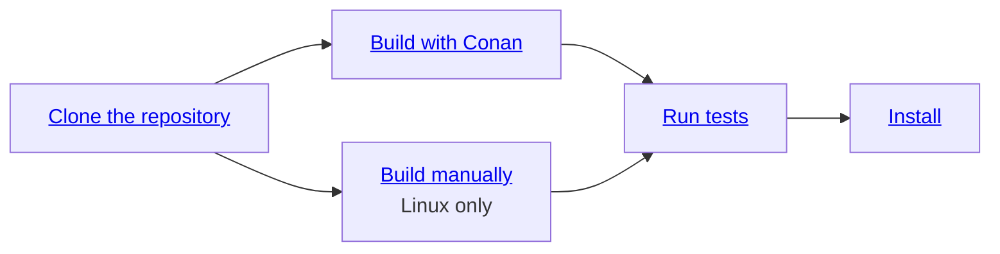

# Building OSRM from Source

OSRM depends on external libraries. On Linux you can choose to install those libraries
either with a package manager (Conan) or manually (apt-get). On macOS and Windows only
Conan is supported.



## Prerequisites {#clone}

Clone the github repository:

```bash
git clone https://github.com/Project-OSRM/osrm-backend.git
cd osrm-backend
npm ci --ignore-scripts
```
Note: here `ci` means "clean install" and not "continuous integration".

## Build using Conan {#conan}

This build method works on Linux, macOS and Windows (Tested on Ubuntu-24.04,
Ubuntu-22.04, macOS-24, macOS-15, macOS-14, Windows-Server-2025, and Windows-Server-2022.)
On Windows a Linux-compatible toolset like mingw is needed.

First install Conan. You have to do this only once after a git clone.

```bash
scripts/install_conan.sh
```

Then say:

```bash
source scripts/activate_conan
conan build -pr home --build=missing
```

The binaries are now in `build/Release`.

Note: you need to activate Conan only once for every shell you open.

A list of arguments for Conan:

| Argument          | Default   | Description                                  |
| ----------------- | --------- | -------------------------------------------- |
| `-s build_type`   | `Release` | Specify the build type: `Release` or `Debug` |
| `-o asan`         | `False`   | Enable Address SANitizer                     |
| `-o assertions`   | `False`   | Enable assertions in release build           |
| `-o ccache`       | `True`    | Use ccache if available                      |
| `-o coverage`     | `False`   | Enable coverage instrumentation              |
| `-o lto`          | `True`    | Enable Link-Time-Optimization                |
| `-o node_package` | `False`   | Build the Node package                       |
| `-o sccache`      | `False`   | Use sccache if available                     |
| `-o shared`       | `False`   | Build with shared libs                       |
| `-o ubsan`        | `False`   | Enable Undefined Behaviour SANitizer         |
| `-o cc`           | standard  | Use this binary as C Compiler                |
| `-o cxx`          | standard  | Use this binary as C++ Compiler              |
| `-o clang-tidy`   | none      | Use this binary as linter                    |

Proceed with [testing](#tests).

## Build manually

This alternative build method is supported on Linux only. (It probably works on macOS
too, if using `brew` instead of `apt-get`. Patches to the docs are welcome.)

Install dependencies:

```bash
sudo apt-get install -y libbz2-dev libxml2-dev libzip-dev liblua5.2-dev libtbb-dev libboost-all-dev
```

Build:

```bash
cmake -B build/Release
make -C build/Release -j
```

The binaries are now in `build/Release`.

A list of arguments for cmake:

| Argument                 | Default   | Description                                         |
| ------------------------ | --------- | --------------------------------------------------- |
| `-DCMAKE_BUILD_TYPE`     | `Release` | Specify the build type: `Release` or `Debug`        |
| `-DBUILD_SHARED_LIBS`    | `OFF`     | Build with shared libs                              |
| `-DBUILD_NODE_PACKAGE`   | `OFF`     | Build the Node package                              |
| `-DBUILD_PACKAGE`        | `OFF`     | Build OSRM package                                  |
| `-DENABLE_ASSERTIONS`    | `OFF`     | Use assertions in release mode                      |
| `-DENABLE_CCACHE`        | `ON`      | Speed up incremental rebuilds via ccache            |
| `-DENABLE_SCCACHE`       | `OFF`     | Speed up incremental rebuilds via sccache           |
| `-DENABLE_LTO`           | `ON`      | Use Link Time Optimization                          |
| `-DENABLE_COVERAGE`      | `OFF`     | Build with coverage instrumentalization             |
| `-DENABLE_DEBUG_LOGGING` | `OFF`     | Use debug logging in release mode                   |
| `-DENABLE_FUZZING`       | `OFF`     | Fuzz testing using LLVM's libFuzzer                 |
| `-DENABLE_ASAN`          | `OFF`     | Use address sanitizer for Debug build               |
| `-DENABLE_TSAN`          | `OFF`     | Use thread sanitizer for Debug build (experimental) |
| `-DENABLE_UBSAN`         | `OFF`     | Use undefined behaviour sanitizer for Debug build   |
| `-DCMAKE_C_COMPILER`     | standard  | Which C compiler to use: `clang-19` ...             |
| `-DCMAKE_CXX_COMPILER`   | standard  | Which C++ compiler to use: `clang++-19` ...         |
| `-DCMAKE_CXX_CLANG_TIDY` | none      | Which clang-tidy to use: `clang-tidy-19` ...        |

Proceed with [testing](#tests).

## Build variations

### Specify compiler

To build with a specified compiler, eg. clang-21 when gcc is the default, for Conan builds:

```bash
conan build -pr home --build=missing -o cc=clang-21 -o cxx=clang++-21
```

For apt-get builds, before building say:

```bash
export CC=clang-21
export CXX=clang++-21
```
Then run the build as shown above.

### Debug build

To do a debug build, for Conan builds:

```bash
conan build -pr home --build=missing -s build_type=Debug
```

For apt-get builds:

```bash
cmake -B build/Debug -DCMAKE_BUILD_TYPE=Debug
make -C build/Debug -j
```
The binaries will be in `build/Debug`. You can have a `build/Release` at the same time.

### Build Node package

To build the Node package, for Conan builds:

```bash
conan build -pr home --build=missing -o node_package=True
```

For apt-get builds:

```bash
cmake -B build/Release -DBUILD_NODE_PACKAGE=ON
make -C build/Release -j
scripts/ci/build_node_package.sh
```
The node binaries are now in `build/nodejs/lib/binding_napi_v8`.

### Other tricks

To learn how OSRM is built on the github CI you may consult the file
`.github/workflows/osrm-backend.yml` and the files under `.github/actions/`.

## Tests {#tests}

### Unit tests {#unit-tests}

To run the unit tests:

```bash
make -C build/Release -j tests benchmarks
ctest --test-dir build/Release/unit_tests/ -j
```

### Cucumber tests {#cucumber}

To run the Cucumber tests:

```bash
npm test -- --parallel 16
```

## Install

```bash
cmake --install build/Release --prefix /usr/local/or/whatever
```


## The Build Process

The `build` directory is a hardcoded 'well-known' location for bootstrapping build- and
runtime configurations.  The `build` directory is used for communication between the
stages of the build toolchain if the actual build of binaries should take place elsewhere.

Conan puts `conan.env` and Cmake puts `osrm-run.env` there.  `.env` files should only
contain `KEY=VALUE` pairs so they can safely be sourced or piped into `$GITHUB_ENV`.

#### build/conan.env

The file `build/conan.env` is generated by Conan. It should be sourced to obtain
information about the build environment setup by Conan.  Usage: `source
build/osrm-run.env`. It contains:

| Environment Variable   | Description                                                                 |
| ---------------------- | --------------------------------------------------------------------------- |
| `CONAN_GENERATORS_DIR` | The location where `conan-build-env.sh` and `conan-run-env.sh` are emitted. |
| `CONAN_BUILD_DIR`      | The build directory Cmake should use.                                       |
| `CONAN_CMAKE_PRESET`   | The preset Cmake should use for building.                                   |
| `CONAN_LIBRARY_PATH`   | The search path for the libraries.                                          |

This file is only present in Conan builds.  After running Conan and sourcing this file
you can call Cmake like this: `cmake -B $CONAN_BUILD_DIR --preset $CONAN_CMAKE_PRESET`


#### build/osrm-run.env

The file `build/osrm-run-env.sh` is generated by Cmake. It can be sourced to obtain
information about the build environment setup by Cmake. Usage: `source
build/osrm-run-env.sh`. It contains:

| Environment Variable         | Description                                                |
| ---------------------------- | ---------------------------------------------------------- |
| `OSRM_BUILD_DIR`             | The directory where the OSRM binaries will be built.       |
| `OSRM_UNIT_TESTS_BUILD_DIR`  | The directory where the unit tests will be built.          |
| `OSRM_BENCHMARKS_BUILD_DIR`  | The directory where the benchmarks will be built.          |
| `OSRM_NODEJS_BUILD_DIR`      | The directory where the node bindings will be built.       |
| `OSRM_NODEJS_INSTALL_DIR`    | The directory where the node bindings will be installed.   |
| `OSRM_TEST_DATA_DIR`         | The directory containing the curated test data.            |
| `OSRM_BINARY_DIR`            | 'build' on MSVC 'build/Release' else                       |
| `OSRM_UNIT_TESTS_BINARY_DIR` | 'build/unit_tests' on MSVC 'build/Release/unit_tests' else |
| `OSRM_BENCHMARKS_BINARY_DIR` |                                                            |
| `OSRM_NODEJS_BINARY_DIR`     |                                                            |

Note: multi-config generators (like Visual Studio or Xcode) generate the artifacts in a
`/Release` or `/Debug` subdirectory of the configured build directory. The `OSRM_BUILD_DIR`
variants always include these subdirectories: use them to find the actual files. The
`OSRM_BINARY_DIR` variants do not always include these subdirectories: use them as
cmdline parameters to `cmake` / `ctest`.


#### build/osrm-run-env.sh

The file `build/osrm-run-env.sh` can be sourced to setup a runtime environment in which
the built binaries can be run.
