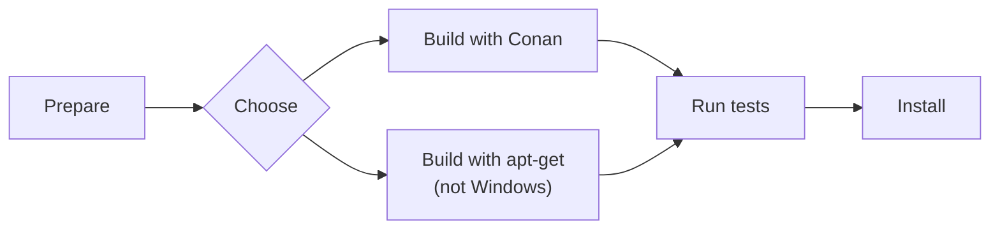

# How-To Build OSRM from Source

This How-To explans how to build OSRM from source. It assumes familiarity with `git`,
`cmake`, and a C++ compiler.  On Windows it assumes a Linux-compatible toolset like
MSYS2 is installed.



## Prepare {#clone}

Clone the github repository and install node files:

```bash
git clone https://github.com/Project-OSRM/osrm-backend.git
cd osrm-backend
npm ci --ignore-scripts
```

## Choose a Package Manager {#choose}

Now you must choose a package manager to install dependencies:

- a C++ package manager like Conan or,
- a system package manager like `apt-get` or `brew`.

On Windows only the Conan package manager is supported.[^1]

The build method with Conan is tested on Ubuntu-24.04, Ubuntu-22.04, macOS-26, macOS-15,
macOS-14, Windows-Server-2025, and Windows-Server-2022.  Conan downloads the sources of
the dependencies and compiles them on your machine.  More things can go wrong, it takes
longer, but you always get the newest versions.

The build method with `apt-get` or `brew` is tested on Ubuntu-24.04, Ubuntu-22.04, and
macOS-15.  It uses the package manager that comes with the OS.  While using a system
package manager has its advantages, there are also some drawbacks to consider.  These
include lack of control over the installation process, and the use of outdated versions,
which may be several years old.

[^1]: That doesn't mean there is no other way, just that we didn't have the time and
      hardware to figure it out for you.  If you know how to, please submit a patch.

## Build with Conan {#conan}

First install Conan. You have to do this only once after a git clone.

```bash
scripts/install_conan.sh
```

Then activate Conan. You have to activate Conan only once for every shell you open.

```bash
source scripts/activate_conan
```

Then build it:

```bash
conan build -pr home --build=missing
```
The OSRM binaries are now in `build/Release`.

To build the node package (optional):

```bash
conan build -pr home --build=missing -o node_package=True
```
The node binaries are now in `build/nodejs/lib/binding_napi_v8`.

Proceed with [testing](#tests).


## Get Dependencies with the System Package Manager {#apt}

This alternative build method is not supported on Windows.

Install dependencies (Linux):

```bash
sudo apt-get install -y libbz2-dev libxml2-dev libzip-dev liblua5.2-dev libtbb-dev libboost-all-dev
```

or (macOS):

```bash
brew install bzip2 libzip lua tbb boost
```

Then build with:

```bash
cmake -B build/Release
cmake --build build/Release -j
```

The OSRM binaries are now in `build/Release`.

Optional: To build the node package, type this instead of the above 2 lines:

```bash
cmake -B build/Release -DBUILD_NODE_PACKAGE=ON
cmake --build build/Release -j
scripts/ci/build_node_package.sh
```

The OSRM binaries are now in `build/Release` and the node binaries are in
`build/nodejs/lib/binding_napi_v8`.


## Test {#tests}

### Unit tests {#unit-tests}

To run the unit tests:

```bash
cmake --build build/Release -j --target tests
source build/osrm-run-env.sh
ctest --test-dir build/Release -C Release -L tests -j
```

### Cucumber tests {#cucumber}

To run the Cucumber tests:

```bash
npm test -- --parallel 16
```

## Install

Install OSRM into custom directories:

```bash
cmake --install build/Release --config Release --prefix ~/my/install/dir
```

Or, you have to `sudo` to install into system directories:

```bash
sudo cmake --install build/Release --config Release
```
