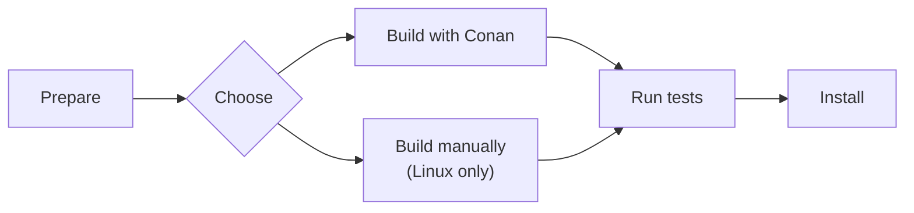

# How-To Build OSRM from Source

This How-To explans how to build OSRM from source. It assumes familiarity with `git`,
`cmake`, and a C++ compiler.  On Windows it assumes a Linux-compatible toolset like
MSYS2 is installed.



## Prepare {#clone}

Clone the github repository and install node files:

```bash
git clone https://github.com/Project-OSRM/osrm-backend.git
cd osrm-backend
npm ci --ignore-scripts
```

## Choose Package Manager {#choose}

On Linux you must choose whether to install dependencies with a package manager (Conan)
or manually (apt-get).  On macOS and Windows only Conan is supported.

The build method with Conan is tested on Ubuntu-24.04, Ubuntu-22.04, macOS-24, macOS-15,
macOS-14, Windows-Server-2025, and Windows-Server-2022.  Conan downloads the sources of
the dependencies and compiles them on your machine.  More things can go wrong, it takes
longer, but you always get the newest versions.

The build method with manual install uses the package manager installed by your system.
On Debian this is apt-get.  Less things can go wrong, it is faster, but you only get the
latest version provided by you system maintainers.


## Build with Conan {#conan}

First install Conan. You have to do this only once after a git clone.

```bash
scripts/install_conan.sh
```

Then activate Conan. You have to activate Conan only once for every shell you open.

```bash
source scripts/activate_conan
```

Then build it:

```bash
conan build -pr home --build=missing
```
The OSRM binaries are now in `build/Release`.

To build the node package (optional):

```bash
conan build -pr home --build=missing -o node_package=True
```
The node binaries are now in `build/nodejs/lib/binding_napi_v8`.

Proceed with [testing](#tests).

## Build manually

This alternative build method is supported on Linux only. (It probably works on macOS
too, if using `brew` instead of `apt-get`. Patches to the docs are welcome.)

Install dependencies:

```bash
sudo apt-get install -y libbz2-dev libxml2-dev libzip-dev liblua5.2-dev libtbb-dev libboost-all-dev
```

Build:

```bash
cmake -B build/Release
cmake --build build/Release -j
```

The OSRM binaries are now in `build/Release`.

Optional: To build the node package, type this instead of the above 2 lines:

```bash
cmake -B build/Release -DBUILD_NODE_PACKAGE=ON
cmake --build build/Release -j
scripts/ci/build_node_package.sh
```

The OSRM binaries are now in `build/Release` and the node binaries are in
`build/nodejs/lib/binding_napi_v8`.


## Test {#tests}

### Unit tests {#unit-tests}

To run the unit tests:

```bash
cmake --build build/Release -j --target tests
source build/osrm-run-env.sh
ctest --test-dir build/Release -C Release -L tests -j
```

### Cucumber tests {#cucumber}

To run the Cucumber tests:

```bash
npm test -- --parallel 16
```

## Install

Install OSRM into custom directories:

```bash
cmake --install build/Release --config Release --prefix ~/my/install/dir
```

Or, you have to `sudo` to install into system directories:

```bash
sudo cmake --install build/Release --config Release
```
