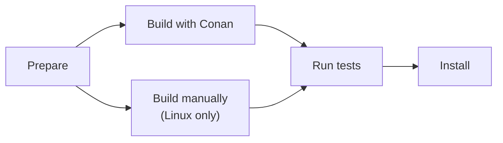

# How-To Build OSRM from Source

OSRM depends on external libraries. On Linux you can choose to install those libraries
either with a package manager (Conan) or manually (apt-get). On macOS and Windows only
Conan is supported.



## Prepare {#clone}

Clone the github repository and install node files:

```bash
git clone https://github.com/Project-OSRM/osrm-backend.git
cd osrm-backend
npm ci --ignore-scripts
```

## Build with Conan {#conan}

This build method works on Linux, macOS and Windows (Tested on Ubuntu-24.04,
Ubuntu-22.04, macOS-24, macOS-15, macOS-14, Windows-Server-2025, and Windows-Server-2022.)
On Windows a Linux-compatible toolset like mingw is needed.

First install Conan. You have to do this only once after a git clone.

```bash
scripts/install_conan.sh
```

Then activate Conan. You have to activate Conan only once for every shell you open.

```bash
source scripts/activate_conan
```

Then build it:

```bash
conan build -pr home --build=missing
```
The OSRM binaries are now in `build/Release`.

To build the node package (optional):

```bash
conan build -pr home --build=missing -o node_package=True
```
The node binaries are now in `build/nodejs/lib/binding_napi_v8`.

Proceed with [testing](#tests).

## Build manually

This alternative build method is supported on Linux only. (It probably works on macOS
too, if using `brew` instead of `apt-get`. Patches to the docs are welcome.)

Install dependencies:

```bash
sudo apt-get install -y libbz2-dev libxml2-dev libzip-dev liblua5.2-dev libtbb-dev libboost-all-dev
```

Build:

```bash
cmake -B build/Release
cmake --build build/Release -j
```

The OSRM binaries are now in `build/Release`.

Optional: To build the node package, type this instead of the above 2 lines:

```bash
cmake -B build/Release -DBUILD_NODE_PACKAGE=ON
cmake --build build/Release -j
scripts/ci/build_node_package.sh
```

The OSRM binaries are now in `build/Release` and the node binaries are in
`build/nodejs/lib/binding_napi_v8`.


## Test {#tests}

### Unit tests {#unit-tests}

To run the unit tests:

```bash
cmake --build build/Release -j --target tests
source build/osrm-run-env.sh
ctest --test-dir build/Release -C Release -L tests -j
```

### Cucumber tests {#cucumber}

To run the Cucumber tests:

```bash
npm test -- --parallel 16
```

## Install

Install OSRM into custom directories:

```bash
cmake --install build/Release --config Release --prefix ~/my/install/dir
```

Or, you have to `sudo` to install into system directories:

```bash
sudo cmake --install build/Release --config Release
```
